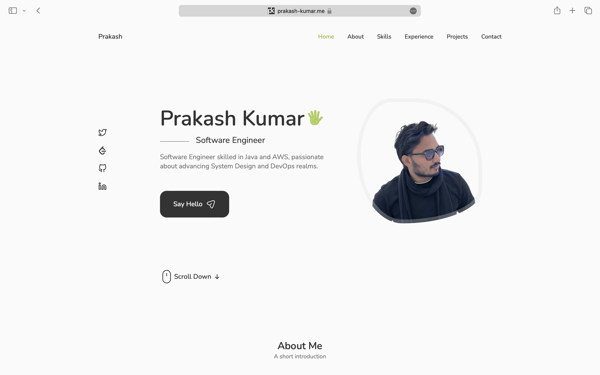
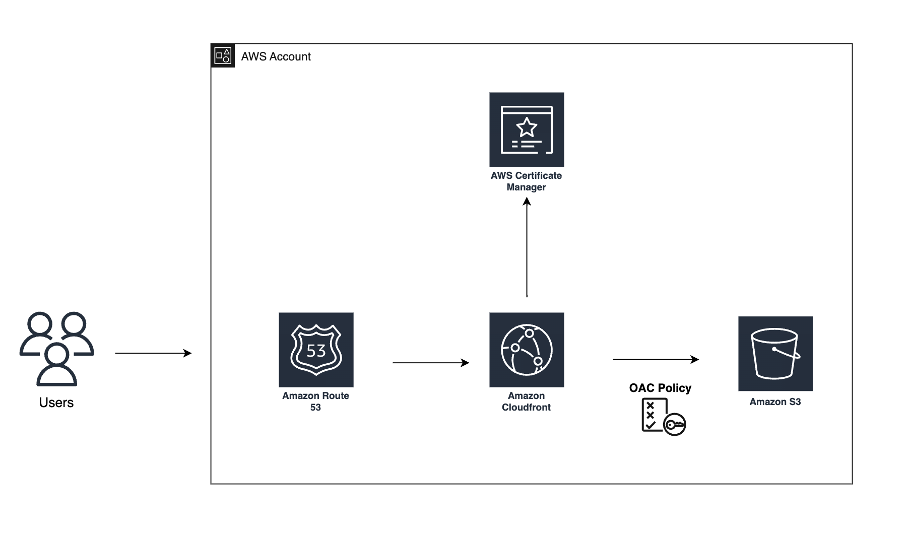

# Portfolio Website Readme
Link to website: https://prakash-kumar.me/

Welcome to my portfolio website! This repository contains the code for a sleek and responsive portfolio website built using ReactJS, EmailJS, CSS, and integrated with various other technologies to enhance user experience and streamline functionality.

## Architecture
The architecture of the portfolio website deployment on AWS involves the following components:
- Route53: Acts as the DNS service for the website, enabling users to access it via a user-friendly domain name.
- CloudFront: Utilized as a content delivery network (CDN) to distribute the website's content globally, reducing latency and enhancing performance.
- S3 Bucket: Stores the static assets of the website, including HTML, CSS, JavaScript, and media files.
- ReactJS: The frontend of the website is built using ReactJS, providing a dynamic and interactive user interface.
- EmailJS: Integrated for handling contact form submissions, allowing users to send messages directly from the website.

## Workflow
This image illustrates the workflow of the portfolio website's architecture, showcasing how the various components interact to deliver a seamless user experience.

## Credit
The frontend of this project was created based on a tutorial by Cryptical Coder. It covers building a portfolio website using ReactJS, EmailJS, and CSS. You can find the tutorial [here](https://www.youtube.com/watch?v=3aCoZudPEKE&t=143s&ab_channel=CrypticalCoder).
